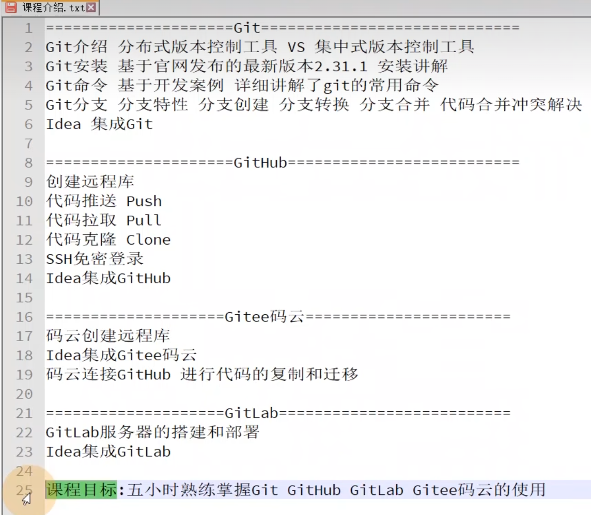
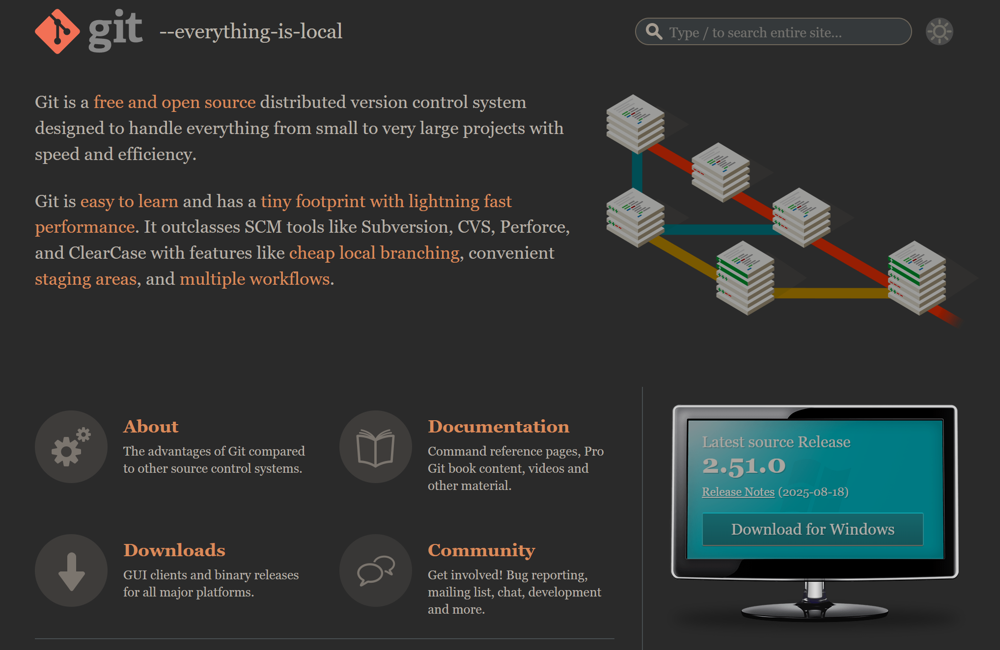
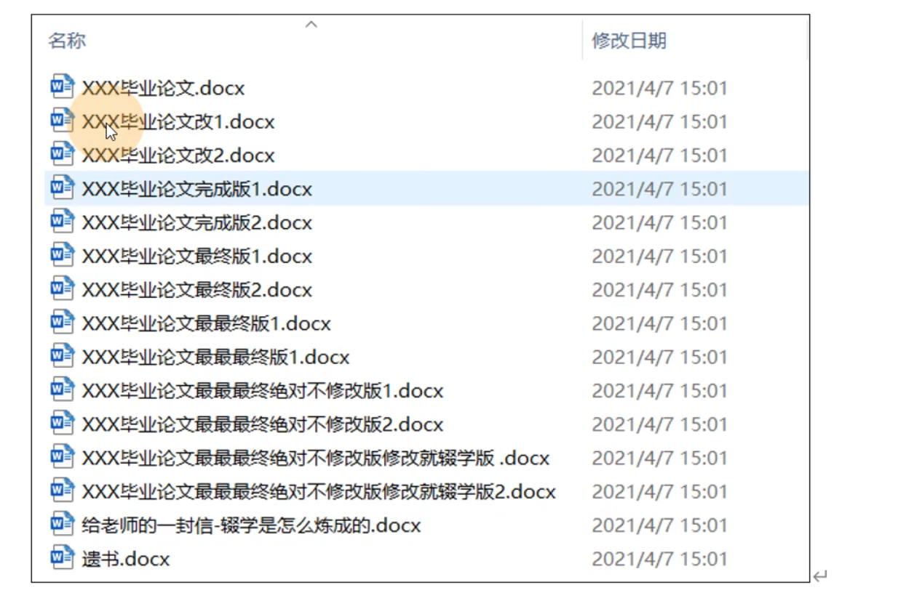
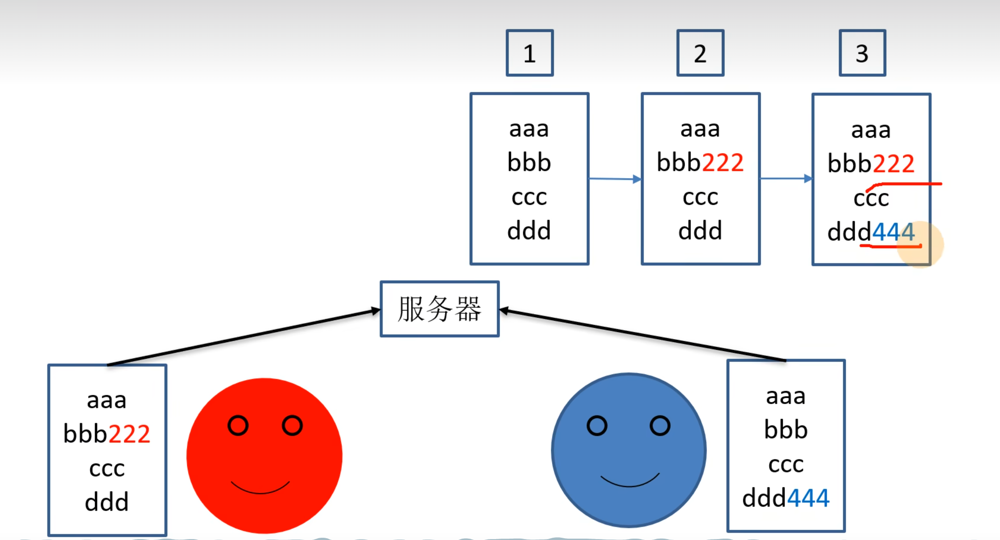

学完c之后我有一点意识到成为合格的程序员不仅仅要求掌握语言，还要求掌握各种工具。
目前来说我对git的掌握需求比较高，所以我先来学学git吧！
课程链接：https://www.bilibili.com/video/BV1vy4y1s7k6
课程的大致流程：

# 1. git概述
git是一个免费的，开源的**分布式版本控制系统**，可以快速高效地处理从小型到大型的各种项目。公司中用git管理代码，因此只要写代码，就得接触git。
git易于学习，占地面积小，性能极快。用有廉价的本地库，方便的暂存区，和多工作流分支的特性。其性能优于Subversion、CVS、Perforce和ClearCase等版本控制工具。
>Q: 免费可以理解，开源应该就是源代码公开，可是分布式，版本控制，系统都是啥东西？
A: 分布式对应集中式，分布式版本控制对应集中式版本控制。
Q：还有啊，廉价的本地库这里的廉价指的应该是空间使用上的廉价吧？

总之，学习一个工具的第一步就是先看看它的官网：https://git-scm.com/
顺带一提，目前git最新版本是2.51.0，老师那会最新版本是2.31.1！

git的图标是一个分支，可见对其分支功能的自信，后面跟着的一句话是：
“所有的都在本地”

## 1.1 什么是版本控制？
版本控制是一种记录文件内容变化，以便需要时查阅特定版本修订情况的系统。
所以它可以记录文件的修改历史记录，以便与之前的内容进行对比和复原。可见这个功能多么重要。

比如这张图，明明只是一个梗图，可是改一个毕业论文为什么要这么多文件？
想必是，修改之后不一定比修改之前的好，所以复制一份，在复制文件上进行修改才是聪明的选择。
比如毕业论文改1和改2，想必是改1没有改好，才又复制了一份原件，才来的改2。以此类推。
而这个保留之前的文件的行为就体现了版本控制的思想。
那么我们为啥还需要git这样的工具呢？直接备份文件不就好了？
1. 可以看到过程还是比较繁琐。
2. 在公司中不是个人开发而是团队合作。

## 1.2 为什么要版本控制？
为什么从个人开发过渡到团队合作就需要版本控制？
请看
示例图：

简单来说，如果是团队合作，红蓝都复制了一份原件，都进行了修改，如果是文件复制的形式进行的版本控制，就可能导致覆盖和无法合并的问题。而专业的版本控制工具，就能实现3的效果。
## 1.3 版本控制工具
上面提到，版本控制工具也分为分布式和集中式，先介绍一下关于集中式版本控制工具的内容。
所以，先分析一下多人合作的情况下，仍使用原始的文件拷贝在版本控制上会出现什么问题：
1. 假如一份原件两个人同时修改，就会出现无法合并的冲突，需要手动解决，耗时耗力。 而且为了避免冲突，可能就导致同一份原件不能很多人修改，不然就有各种不同的版本。 这也会导致同一时间上能工作的人有限。得等其他人修改并提交，下一个人才能在修改代码的基础上再修改。
2. 代码版本是保存在本地上的，就意味着其他人无法随意取用，效率就非常低。 还有就是，同一份版本文件，每个人都进行了很多版本的修改，最后百家争鸣，无法确定哪一个才是权威的真相。而且版本控制也很麻烦。

所以版本控制主要针对这两个问题：文件合并问题，代码管理问题。
### 集中式版本控制工具
使用集中式版本控制工具的系统有：CVS、SVN(Subversion),VSS...
现在使用集中式版本控制系统的公司比较少。
*2025.9.4*
针对代码管理问题，集中式版本控制系统给出的答卷是：**使用中央服务器管理，永远以服务器上版本为权威**。同时也带来了其他好处：
- 查看提交历史（Commit History）：任何开发者都可以从中央服务器上拉取完整的提交日志。这就像看一个公共公告板，上面写着：
“张三 - 2小时前 - 修复了登录页面的Bug (#123)”
“李四 - 1小时前 - 添加了用户个人资料页面 (#124)”
“王五 - 5分钟前 - 更新了项目文档”
- 比较差异（Diff）：你可以查看任何两次提交之间的具体代码差异，精确地知道某一行代码是谁、在什么时候、因为什么原因修改的。
- 权限控制：在一个服务器中，管理员可以针对不同的人开放不同的权限，比如对实习生就没什么权限，防止改坏代码。

对于文件合并的问题，集中式版本管理系统的解决方式是：**更新(updata)与合并算法**。
先梳理一下怎么一次工作分几步：
1. 从服务器拉取代码。
2. 更删查改代码。
3. 提交代码。

简单就能得出这样一个结论：问题的核心在提交代码的过程。
代码的冲突是在提交时发现的，比如拉取代码时版本是1.0，等到要提交时，最新版本已经是1.3了。所以，在提交代码时多出了一个更新(updata)的操作，通过更新，可以将你在1.0版本基础上修改的代码合并到最新版本上。此操作的核心是合并算法。
合并算法会处理这三种基本情况：
- 最佳情况（修改不同文件）：A先完成了他的工作（比如修改了login.py），他将修改提交（Commit）到中央服务器。之后，B在提交前，需要先执行更新（Update） 操作。算法会智能地将服务器上的最新更改（包括A修改的login.py）合并到B的本地代码中。由于B没有修改login.py，这个合并过程毫无冲突，B可以顺利提交他修改的（比如profile.py）。

- 常见情况（修改同一文件的不同部分）：A修改了utils.py文件开头的某个函数并提交。B在本地修改了utils.py文件末尾的另一个函数。当B更新时，算法会尝试自动合并。因为它能识别出这两处修改不在同一个地方，没有冲突，所以它会成功地将A的修改和B的本地修改合并在一起。然后B再提交，这个合并后的utils.py就包含了两个人的工作。

- 冲突情况（修改同一文件的同一部分）：如果A和B都修改了utils.py文件的同一行代码。当后提交的人（比如B）进行更新时，算法无法自动判断应该保留谁的修改，这时就会发生冲突（Conflict）。

这就是集中式版本管理系统的核心。同时也有一个显而易见的，严重的弊端：中央服务器就是代码的命脉；中央服务器出问题，所有工作全部无法继续；中央服务器代码丢失，那基本上所有工作成果付之东流。
问题出现，用户减少，
所以就出现了
### 分布式版本控制工具
Git、Mercurial、Bazaar、Darcs...
为什么不能接受中央服务器数据丢失，个人本地总会有提交的最新版本吧？
所以重要的不仅仅是最新版本的代码，还有一系列提交历史。
针对这一想法，分布式版本控制工具应运而生。
**针对个人来说**，分布式版本控制工具可以是一个方便版本控制的工具。git中，使用git init指令。
这个命令的作用是：
在当前目录创建一个名为 .git 的隐藏子目录。
这个 .git 目录就是你本地版本库的全部，里面包含了未来所有版本记录所需的数据结构（对象库、引用、索引等）。
此时，你的工作目录和这个新的本地库就关联起来了。你可以开始添加文件 (git add)、提交更改 (git commit)，构建完整的提交历史。
**对于服务器上托管代码的需求**，分布式版本控制系统相比于集中式来说，区别较大的是从服务器拉取代码这个操作。
- 集中式是拉取最新文件。
- 分布式是拉取整个项目历史的所有数据（所有分支、所有提交、所有标签）。你的本地仓库就是服务器仓库的一个完整克隆。

所以，分布式不仅提供了云端保存的功能，还使得拉取后进行的查找历史版本，对比更改的行为完全的本地化，不需要网络连接到服务器就可以完成。即使服务器宕机，本地库作为服务器数据的完全拷贝，完全可以当作新的权威。使得代码丢失的概率大大降低。
**对于团队开发**，由于本地库的存在，每一个成员都可以拥有项目历史的所有数据，导致项目开发可以脱离网络，以其中一个本地库作为大家口头约定的中央库。不过一般还是会使用云端仓库（gitee，github）。同时，每个人都有完整备份，使得代码丢失的可能性趋近于0。
