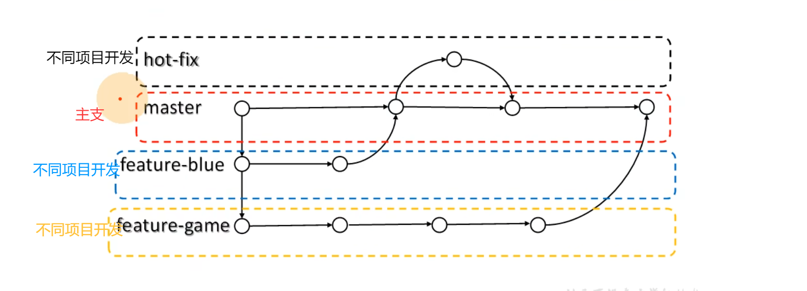

学完c之后我有一点意识到成为合格的程序员不仅仅要求掌握语言，还要求掌握各种工具。
目前来说我对git的掌握需求比较高，所以我先来学学git吧！
课程链接：https://www.bilibili.com/video/BV1vy4y1s7k6
课程的大致流程：

# 1. git概述
git是一个免费的，开源的**分布式版本控制系统**，可以快速高效地处理从小型到大型的各种项目。公司中用git管理代码，因此只要写代码，就得接触git。
git易于学习，占地面积小，性能极快。用有廉价的本地库，方便的暂存区，和多工作流分支的特性。其性能优于Subversion、CVS、Perforce和ClearCase等版本控制工具。
>Q: 免费可以理解，开源应该就是源代码公开，可是分布式，版本控制，系统都是啥东西？
A: 分布式对应集中式，分布式版本控制对应集中式版本控制。
Q：还有啊，廉价的本地库这里的廉价指的应该是空间使用上的廉价吧？

总之，学习一个工具的第一步就是先看看它的官网：https://git-scm.com/
顺带一提，目前git最新版本是2.51.0，老师那会最新版本是2.31.1！

git的图标是一个分支，可见对其分支功能的自信，后面跟着的一句话是：
“所有的都在本地”

## 1.1 什么是版本控制？
版本控制是一种记录文件内容变化，以便需要时查阅特定版本修订情况的系统。
所以它可以记录文件的修改历史记录，以便与之前的内容进行对比和复原。可见这个功能多么重要。

比如这张图，明明只是一个梗图，可是改一个毕业论文为什么要这么多文件？
想必是，修改之后不一定比修改之前的好，所以复制一份，在复制文件上进行修改才是聪明的选择。
比如毕业论文改1和改2，想必是改1没有改好，才又复制了一份原件，才来的改2。以此类推。
而这个保留之前的文件的行为就体现了版本控制的思想。
那么我们为啥还需要git这样的工具呢？直接备份文件不就好了？
1. 可以看到过程还是比较繁琐。
2. 在公司中不是个人开发而是团队合作。

## 1.2 为什么要版本控制？
为什么从个人开发过渡到团队合作就需要版本控制？
请看
示例图：

简单来说，如果是团队合作，红蓝都复制了一份原件，都进行了修改，如果是文件复制的形式进行的版本控制，就可能导致覆盖和无法合并的问题。而专业的版本控制工具，就能实现3的效果。
## 1.3 版本控制工具
上面提到，版本控制工具也分为分布式和集中式，先介绍一下关于集中式版本控制工具的内容。
所以，先分析一下多人合作的情况下，仍使用原始的文件拷贝在版本控制上会出现什么问题：
1. 假如一份原件两个人同时修改，就会出现无法合并的冲突，需要手动解决，耗时耗力。 而且为了避免冲突，可能就导致同一份原件不能很多人修改，不然就有各种不同的版本。 这也会导致同一时间上能工作的人有限。得等其他人修改并提交，下一个人才能在修改代码的基础上再修改。
2. 代码版本是保存在本地上的，就意味着其他人无法随意取用，效率就非常低。 还有就是，同一份版本文件，每个人都进行了很多版本的修改，最后百家争鸣，无法确定哪一个才是权威的真相。而且版本控制也很麻烦。

所以版本控制主要针对这两个问题：文件合并问题，代码管理问题。
### 集中式版本控制工具
使用集中式版本控制工具的系统有：CVS、SVN(Subversion),VSS...
现在使用集中式版本控制系统的公司比较少。
*2025.9.4*
针对代码管理问题，集中式版本控制系统给出的答卷是：**使用中央服务器管理，永远以服务器上版本为权威**。同时也带来了其他好处：
- 查看提交历史（Commit History）：任何开发者都可以从中央服务器上拉取完整的提交日志。这就像看一个公共公告板，上面写着：
“张三 - 2小时前 - 修复了登录页面的Bug (#123)”
“李四 - 1小时前 - 添加了用户个人资料页面 (#124)”
“王五 - 5分钟前 - 更新了项目文档”
- 比较差异（Diff）：你可以查看任何两次提交之间的具体代码差异，精确地知道某一行代码是谁、在什么时候、因为什么原因修改的。
- 权限控制：在一个服务器中，管理员可以针对不同的人开放不同的权限，比如对实习生就没什么权限，防止改坏代码。

对于文件合并的问题，集中式版本管理系统的解决方式是：**更新(updata)与合并算法**。
先梳理一下怎么一次工作分几步：
1. 从服务器拉取代码。
2. 更删查改代码。
3. 提交代码。

简单就能得出这样一个结论：问题的核心在提交代码的过程。
代码的冲突是在提交时发现的，比如拉取代码时版本是1.0，等到要提交时，最新版本已经是1.3了。所以，在提交代码时多出了一个更新(updata)的操作，通过更新，可以将你在1.0版本基础上修改的代码合并到最新版本上。此操作的核心是合并算法。
合并算法会处理这三种基本情况：
- 最佳情况（修改不同文件）：A先完成了他的工作（比如修改了login.py），他将修改提交（Commit）到中央服务器。之后，B在提交前，需要先执行更新（Update） 操作。算法会智能地将服务器上的最新更改（包括A修改的login.py）合并到B的本地代码中。由于B没有修改login.py，这个合并过程毫无冲突，B可以顺利提交他修改的（比如profile.py）。

- 常见情况（修改同一文件的不同部分）：A修改了utils.py文件开头的某个函数并提交。B在本地修改了utils.py文件末尾的另一个函数。当B更新时，算法会尝试自动合并。因为它能识别出这两处修改不在同一个地方，没有冲突，所以它会成功地将A的修改和B的本地修改合并在一起。然后B再提交，这个合并后的utils.py就包含了两个人的工作。

- 冲突情况（修改同一文件的同一部分）：如果A和B都修改了utils.py文件的同一行代码。当后提交的人（比如B）进行更新时，算法无法自动判断应该保留谁的修改，这时就会发生冲突（Conflict）。

这就是集中式版本管理系统的核心。同时也有一个显而易见的，严重的弊端：中央服务器就是代码的命脉；中央服务器出问题，所有工作全部无法继续；中央服务器代码丢失，那基本上所有工作成果付之东流。
问题出现，用户减少，
所以就出现了
### 分布式版本控制工具
Git、Mercurial、Bazaar、Darcs...
为什么不能接受中央服务器数据丢失，个人本地总会有提交的最新版本吧？
所以重要的不仅仅是最新版本的代码，还有一系列提交历史。
针对这一想法，分布式版本控制工具应运而生。
**针对个人来说**，分布式版本控制工具可以是一个方便版本控制的工具。git中，使用git init指令。
这个命令的作用是：
在当前目录创建一个名为 .git 的隐藏子目录。
这个 .git 目录就是你本地版本库的全部，里面包含了未来所有版本记录所需的数据结构（对象库、引用、索引等）。
此时，你的工作目录和这个新的本地库就关联起来了。你可以开始添加文件 (git add)、提交更改 (git commit)，构建完整的提交历史。
**对于服务器上托管代码的需求**，分布式版本控制系统相比于集中式来说，区别较大的是从服务器拉取代码这个操作。
- 集中式是拉取最新文件。
- 分布式是拉取整个项目历史的所有数据（所有分支、所有提交、所有标签）。你的本地仓库就是服务器仓库的一个完整克隆。

所以，分布式不仅提供了云端保存的功能，还使得拉取后进行的查找历史版本，对比更改的行为完全的本地化，不需要网络连接到服务器就可以完成。即使服务器宕机，本地库作为服务器数据的完全拷贝，完全可以当作新的权威。使得代码丢失的概率大大降低。
**对于团队开发**，由于本地库的存在，每一个成员都可以拥有项目历史的所有数据，导致项目开发可以脱离网络，以其中一个本地库作为大家口头约定的中央库。不过一般还是会使用云端仓库（gitee，github）。同时，每个人都有完整备份，使得代码丢失的可能性趋近于0。
## 1.4 Git的简史
1991年，linux开源，许多开发者也加入到linux系统的改进中。在那个时代，linux的开发者linus本人只能通过对比和复制粘贴**手动合并代码**。
到了2002年，开发者日益剧增，linus逐渐发现一个人无法完成如此多的手动合并代码工作。于是商业公司处于人道主义关怀，免费授权linux社区免费使用版本控制工具Bitkeeper，但是不能试图破解源代码。
2005年，linux社区的成员Andrew手贱破解了源代码，于是linux社区失去了Bitkeeper的使用权。
可是如此多成员的项目用手动合并代码不可能管理。linux便花了两周时间用c语言写出了Git，一个月之后linux开发版本控制由Git管理。
2008年，linus开发出Github。
## 1.5 Git工作机制
Git版本控制可以分为两个命令，这俩个命令建立在三个区块上。分别是工作区，暂存区，本地库。

所谓工作区，就是项目所在的文件的目录。所以工作区的范围就涵盖了目录下的所有文件。
使用git add命令，可以使得工作区的所有文件，添加进暂存区。我们可以把这个过程想象成把一些物品放进打包盒中。暂存区的内容我们也是可以更改的。就好比我们又想把物品放入打包盒，或者拿出来，都是可以做到的。
git commit命令就相当于是把打包盒封装，寄出。此时已经属于无法修改的状态了，寄出的目的地就是本地库。就像集中式版本控制系统一样，本地库会记录下此时上传的整个打包盒的数据，成为一个历史版本。这就是一次版本控制。
本地库的数据是无法更改的，每一次git commit的数据都会记录在本地库。除非删除本地库，这种行为一般称为“删库跑路”；因为本地库就相当于本地的中央服务器。
## 1.6 Git和代码托管中心
代码托管中心是基于网络服务器的远程代码仓库，一般我们简单称为**远程库**。
当我们使用远程库实现版本控制时，还可以使用git push命令，将本地的库推送到远程仓库。
根据服务器类型分为两类

- 互联网
Github（git官方开发的云仓库）
Gitee码云（国内版Github）

- 局域网

GitLab
如果项目不打算开源，又想使用远程仓库，可以公司自己搭建局域网服务器。然后使用GitLab进行版本控制。
# 2 Git的安装
Git Bash Here
Git的命令行客户端
Git GUI Here
Git的图形化客户端
Git的安装过程中很多选项涉及到Git的很多深层原理，基本使用不需要了解，不过想要使用得更加得心应手，可以深究。
# 3 Git常用命令
一般使用Git会选择命令行界面，linux的很多命令在git中通用。

- git config --global user.name 用户名
设置用户签名

- git config --global user.email 邮箱
设置用户签名
简单来说就相当于变量名的那几个字符一样，没有特别的意义，但是不可或缺。
设置用户签名目的是上传到本地库时有一个身份。用来区分不同设备上传的版本。
这些信息只代表此win设备下的本地身份，与Github或者Gitee上的账号信息没有关系。

- git init
初始化本地库。
当你想在此项目进行版本控制，要么拉取远程库，要么初始化本地库。
在此项目目录下使用git init命令，会在本目录下创建一个.git的文件夹，里面存放版本控制信息。
接下来是查看本地库状态命令：
-  git status
使用这行命令，就会打印出几行日志：
当前分支
本地库信息
暂存区信息
此外有时会显示未追踪的文件，或者更改并没有提交的文件。并且会提示你用什么命令。

我会在这个测试文件目录下，演示git的各项功能。
- git add <文件名>
将指定文件添加至暂存区
比如我新建一个"test.txt"文件，

再使用git status查看，就会发现日志上显示有未追踪的文件"test.txt"(标红)。
接着使用命令"git add test.txt"

"new file:   test.txt"(标绿)
说明这个文件已经被添加到暂存区了，我们之前说过，暂存区的数据是可以增删的，上面也提示了，使用"
- git rm --cached 文件名
删除文件
可以输入"git rm --cached test.txt"就可以从暂存区删除test.txt

可以看到，现在test.txt又被标红说，未被追踪的文件了。
让我们再添加回来
当文件已经按照想要的方式添加到暂存区，下一步就是要提交到本地库了
- git commit -m "日志信息" 文件名
提交到本地库
Q: git commit 和 git commit -m有什么区别呢？
A: 加了-m之后，可以直接在命令后面写日志信息；git commit 的话输入文件名后会跳转到一个界面让你输入日志信息，所以为了方便一般会用git commit -m。
### 文件提交本地库

提交到本地库之后，目录下的test.txt文件多了一个绿色小勾，并且查看日志少了"No commits yet"->“尚未成功提交任何更改”
说明我们的确成功完成了提交。

假如一个程序员修改了一下test.txt文件，然后我们打开git status

噢，不仅目录下文件出现了红叉，日志中也提示有"modified:   test.txt"这个文件被修改了，并且还标红，表示这个文件还没有被添加到暂存区。所以我们还得按照之前的流程提交到本地库。
我们可以用git reflog 和 git log查看下历史版本，

我们可以看到提交过的两个版本都显示在这里，第二次的日志信息我写的就是"2 commit"
### 查看历史版本
- git reflog
查看精简版版本信息
- git log
查看版本详细信息
精简版git reflog可以一目了然地看出此项目经过多少个版本，和当前指向的是哪一个版本。
详细版相比于精简版，首先展示了每个版本的详细版本号，然后多了提交者和提交日期的信息。
每一个版本都对应一个版本号，而当前分支指向哪一个版本又是由版本号决定。
## 版本穿梭
版本控制的主要目的就是保留历史版本，而如果我真的需要回到某一个版本上呢？

- git reset --hard 版本号

我们可以先git reflog 查看精简版版本信息，然后每个版本最前面会显示版本号（简略版），知道了版本号，再用git reflog就可以穿梭到对应版本。

值得注意的是，每当穿梭到历史版本时，

1. 有HEAD -> master字样的版本会有两个
2. 这两个版本的版本号相同
3. 穿梭回历史版本仍然视为一次提交的版本
4. 此版本的日志自动被赋成: moving to 版本号
5.  这个版本和我们想回到的版本就是有HEAD -> master字样的两个版本

不仅如此，在.git/refs/heads/路径下的master文件中，存放的正是有HEAD -> master指向的完整版本号

HEAD 头指针指向 master分支 
master分支指向 对应版本号
Git版本穿梭本质上是改变master指向的版本号
# 4. Git的分支操作
类似于在某一个时间点上分裂出另一条世界线，你可以在另一条世界线上肆意开发，而不用担心主世界线的稳定运行。核心内容就是分裂世界线的操作，这只是一个工具，怎么使用取决于想象力。

一般公司进行软件更新的大概框架，会在主支上创建分支，在分支上进行开发，再在分支上再分支，进行测试，最后完整版开发完全就可以与主支合并。
## 4.1 什么是分支
在版本控制过程中，同时推进多个任务，为每个任务，我们就可以创建每个任务的单独分支。使用分支意味着程序员可以把自己的工作从开发主线上分离开来，开发自己分支的时候，不会影响主线分支的运行。对于初学者而言，分支可以简单理解为副本，一个分支就是一个单独的副本。（分支底层其实也是指针的引用）---摘抄自尚硅谷
## 4.2 分支的好处
对于项目开发最关键的用处就是可以多分支并行开发
再一个就是分支不会相互干涉，比如说开发失败的分支也不会影响其他分支

## 4.3 分支的操作（命令）
通过上面的介绍，分支这个工具最核心的命令就一目了然了。创建分支，
切换分支，合并分支，还有查看目标分支，有了这些功能，分支的作用才得以发挥。当然关于分支的命令不只有这些

- git branch -v
查看当前这个本地库目前存在的分支。
可以看到输入git branch -v 之后，信息显示，当前只有一个分支master，指向的版本号是484319b 版本日志是 “2 commit”
- git branch 分支名
创建分支

hot_fix 热修补；
起这个名的分支在项目中一般用来紧急修补bug
我使用git branch hot_fix 创建了一个分支，并且显示的确创建成功了。但是此时靠右的蓝色括号提示我们，当前还处于master分支上。
那么怎么切换到我想去的分支上呢？
- git checkout 分支名
切换至目标分支。

可以看到，这些地方都提示我们当前处于哪一个分支。
那么我们在这个hot_fix分支上进行修改试试。

1. 在test.txt下加了3行写入2行
2. 新增了一个文件test2.txt

并提交到了本地库
那么我再切换回master分支上，我做出的修改会不会回到master分支上的版本呢？

的确，新增的文件消失了，说明的确回到master分支上了。还有一点是，切换到某分支时，目的分支仍会记录这次切换，视为一次版本提交。
- git merge 分支名
使用这行命令要注意格式。比如我在master分支下输入命令git merge hot_fix时，是把分支hot_fix合并到当前分支master上。

## 4.4 合并冲突问题
### 为什么会出现冲突
我们说过可以把分支理解成不同的世界线，而之所以出现冲突就是因为两条要合并的世界线在同一个位置产生了分歧，版本控制系统不知道要采用哪一个。

如若分支合并时产生了冲突，Git就会把冲突在哪个文件，之类的信息写到日志上显示出来。并且会提示当前指向的分支正在合并中。比如我在master分支合并hot_fix分支时出现冲突，当前状态就是master|merging 正在合并。

如果使用git status命令，也会提示目前冲突的文件有那些。
Git用这些方式提醒你的目的，就是让你明白，现在需要手动打开冲突所在文件，进行手动修改。
关于冲突的文件的冲突部分，Git也会进行一定的标识。Git会在文件中用文字的形式展示当前分支与目标合并分支，以便手动修改者参考。

值得注意的是，修改者对于冲突文件是拥有完全的，最终的决定权的。只要你删除了Git用来表示冲突的标记，就相当于向Git说，“我已经改好了。”Git就会将你目前修改的版本视为冲突解决方案。

当你觉得已经修改的很合适了，就可以先git add 文件名，添加到暂存区，然后提交到库。

必须要说的是，合并冲突时的提交到库比较特殊，此时的git commit类命令不能加文件名，因为两个分支都有此文件，会导致冲突。

合并到当前分支时，被合并的分支是不受影响的，该怎么样就怎么样。

要明白创建分支和合并分支的本质，就要明白分支的本质其实是指向某个版本的指针，创建分支的本质就是再创建一个指针指向原指针指向的版本。

两个分支的历史版本不共享。分支的合并其实是当前两个指针指向的版本之间的合并。

指向指针的指针就是我们的HEAD头指针。
# 5. 远程库命令
## 5.1 创建远程仓库别名
- git remote -v 
查看本地仓库别名
- git remote add 别名 远程地址
就相当于把远程地址这一串东西，重命名成别名。
就比如可以把指向github的一个库的地址