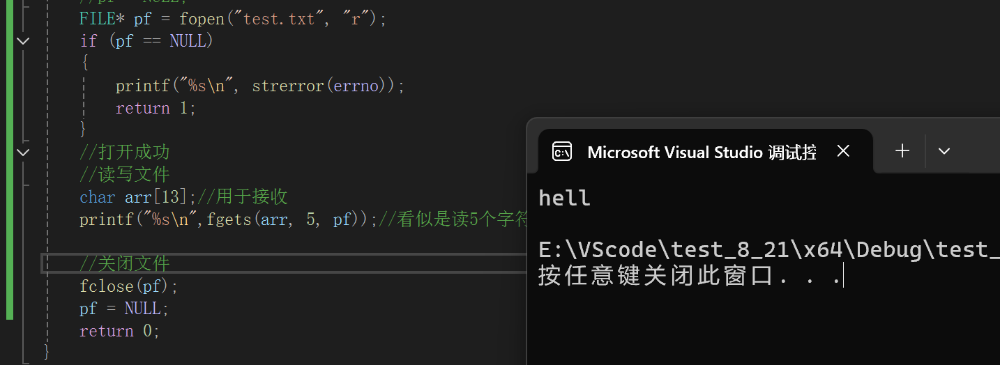
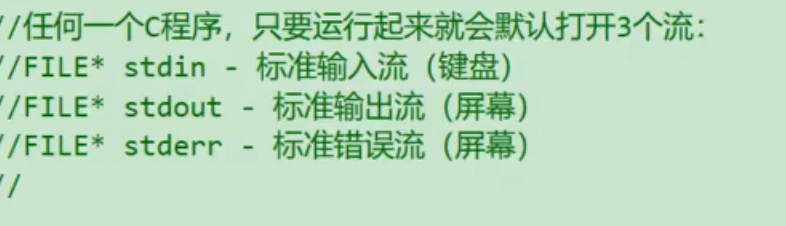
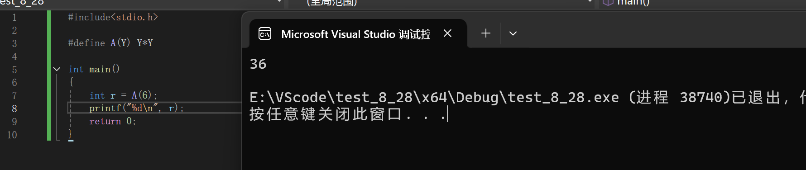
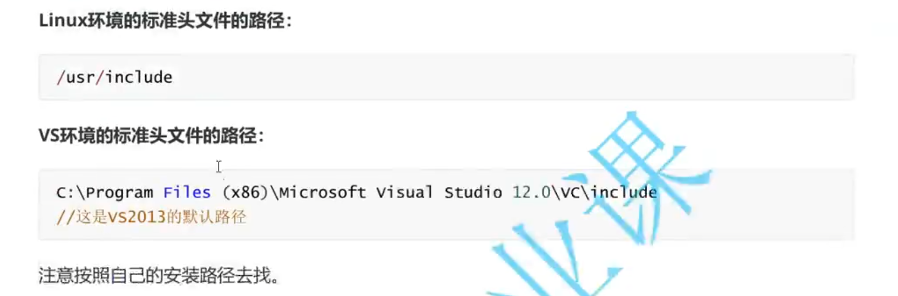

*2025.8.21*
## 杂项
1. 之前我们打印错误信息一般是  
```c 
printf("%s\n",strerror(errno)); 
```
实际上可以使用函数perror
```c 
perror("错误是");
```
如果真的有错误，就会打印"错误是"+  :  + 错误信息。这就比之前方便许多。
2. "格式化"指的是数据在存储介质（如文件）和程序内存之间转换时，需要遵循的结构约定或表示规范。比如
3. ANSI C是由美国国家标准协会（ANSI）及国际标准化组织（ISO）推出的关于C语言的标准。ANSI C 主要标准化了现存的实现， 同时增加了一些来自 C++ 的内容 （主要是函数原型） 并支持多国字符集 （包括备受争议的三字符序列）。 ANSI C 标准同时规定了 C 运行期库例程的标准。
```c
 // 格式化写入：将二进制数据转换为特定格式的文本
    fprintf(pf, "姓名：%s，年龄：%d，工资：%.2f\n", name, age, salary);
```
4. fprintf输入中文时出错，原因暂且不明。
Q：我们说printf是打印，scanf是输入，怎么到文件就反过来了？
A：实际上，printf是**从程序中读取数据**打印出来，scanf是**从外部读取数据到程序**；而把文件视为外部是不是就合理了。一般都是以程序作为第一人称。

5.
```c
#if 常量表达式 
```
判断是否编译代码是根据常量表达式的真假，如果常量表达式需要计算，则与预编译阶段无法识别代码相矛盾；所以**常量表达式性质上等价于常量**。
#### 4.文件的顺序读写

可以看到，对于文件的读写，不仅仅有顺序的不同，还有一次读写多少，按什么形式读写的区别。
下面演示一下：
```c

#include<string.h>
#include<stdio.h>
#include<errno.h>
int main()
{
	FILE* pf = fopen("test.txt", "w");
	if (pf == NULL)
	{
		printf("%s\n", strerror(errno));
		return 1;
	}
	//打开成功
	//读写文件


	//关闭文件
	fclose(pf);
	pf = NULL;
	return 0;
}

```
这就是使用一个文件的大概框架，包含打开，读写，关闭。
Q：为什么需要关闭，不关闭会怎么样？
A：不关闭会占用内存空间，而且不关闭文件可能会对里面的数据造成威胁。现在我们单独拿出读写文件的部分
##### fputc or fgetc
```c
//读写文件
//根据上表，我需要写文件，所以应该使用输出类的函数。
fputc('a',pf);

```

这里成功写入了'a'。关于文件写入具体运作方式我还发现了一些有意思的现象，关于使用文件整个过程不同阶段文件内容的变化，和同一程序多次输入和多次运行程序的不同，不过我猜之后会讲到。
解答：
A：以写入的方式打开文件，如果里面有内容，会 先把内容清空。
Q: 如果我不想清空呢？
A：请用'a'打开，也就是追加。
下面试试读文件吧
```c
	FILE* pf = fopen("test.txt", "r");
	if (pf == NULL)
	{
		printf("%s\n", strerror(errno));
		return 1;
	}
//打开成功
//读写文件
//这里需要输入类函数
char c = fgetc(pf);
printf("%c\n",c);
```
因为这里需要读而不是写，所以就要更改打开文件的方式。

有意思的是，如果我先多次输入一些内容，然后多次读取，每次读取的内容不是第一个输入的内容，而是向后顺延。
```c
#define _CRT_SECURE_NO_WARNINGS
#include<string.h>
#include<stdio.h>
#include<errno.h>
int main()
{
	FILE* pf = fopen("test.txt", "w");
	if (pf == NULL)
	{
		printf("%s\n", strerror(errno));
		return 1;
	}
	//打开成功
	//读写文件
	char i = 0;
	for (i = 'a';i <= 'z';i++)
	{
		fputc(i, pf);
	}
	//关闭文件
	fclose(pf);
	pf = NULL;
	pf = fopen("test.txt", "r");
	if (pf == NULL)
	{
		printf("%s\n", strerror(errno));
		return 1;
	}
	//打开成功
	//读写文件
	//这里需要输入类函数
	char c = (char)fgetc(pf);
	printf("%c\n", c);	
	c = (char)fgetc(pf);
	printf("%c\n", c);
	c = (char)fgetc(pf);
	printf("%c\n", c);
	c = (char)fgetc(pf);
	printf("%c\n", c);
	c = (char)fgetc(pf);
	printf("%c\n", c);
	//关闭文件
	fclose(pf);
	pf = NULL;
	return 0;
}
```

我不禁设想，难道有一个神秘的计数器，能记录本次运行程序读的次数？
有一个要注意的点，如果读取失败，会返回EOF，所以可以加上一个判断EOF，以保证顺利运行。
##### fputs or fgets
下面试试写一行的数据，也就是fputs函数

```c
	FILE* pf = fopen("test.txt", "a");
	if (pf == NULL)
	{
		printf("%s\n", strerror(errno));
		return 1;
	}
	//打开成功
	//读写文件
    fputs("hello world",pf);

	//关闭文件
	fclose(pf);
	pf = NULL;
```
注意这里用的是追加的打开方式。我运行了两次。

下面使用一次读取一行的函数fgets
其实讲了3个这些函数大致规律也比较清晰了，指针是读写必须。读写失败返回值如果是指针就返回NULL，如果是整形就返回EOF。
```c
	FILE* pf = fopen("test.txt", "r");
	if (pf == NULL)
	{
		printf("%s\n", strerror(errno));
		return 1;
	}
	//打开成功
	//读写文件
    char arr[13];//用于接收
    fgets(arr,5,pf);//看似是读5个字符，其实算上'\0'真正读了4个

	//关闭文件
	fclose(pf);
	pf = NULL;
```

##### fprintf or fscanf
讲这么多，这个文件读写函数还是只能以字符或字符串的形式，而要实现别的形式的读写，需要用格式化的读写。
fprintf是写文件，fscanf是读文件。
Q：我们说printf是打印，scanf是输入，怎么到文件就反过来了？
A：实际上，printf是**从程序中读取数据**打印出来，scanf是**从外部读取数据到程序**；而把文件视为外部是不是就合理了。

可以看出，相比于printf只多了一个文件指针。
```c
typedef struct S
{
	char name[13];
	int age;
}SS;

int main()
{
	//打开文件
	FILE* pf = fopen("test.txt", "w");
	if (pf == NULL)
	{
		perror("fopen");
		return 1;
	}
	//读写文件
	SS Z = { "zhangsan",21};
	fprintf(pf, "%s %d", Z.name, Z.age);

	//关闭文件
	fclose(pf);
	pf = NULL;
	return 0;
}
```
再来试试格式化的读取

与scanf的参数也是非常的接近
```c
typedef struct S
{
	char name[13];
	int age;
}SS;

int main()
{
	//打开文件
	FILE* pf = fopen("test.txt", "r");
	if (pf == NULL)
	{
		perror("fopen");
		return 1;
	}
	//读写文件
	SS Z = {0};
	fscanf(pf,"%s %d",Z.name,&(Z.age));

	//关闭文件
	fclose(pf);
	pf = NULL;
	return 0;
}
```

Q：为什么就识别成“zhangsan”和21，而不是“zhangsan 21”？
A：不知道啊

#### 流

Q：上图的最右边，适用于什么什么流是什么意思，流又是什么？
A：流可以理解成程序与外界信息的交界地。
如果对外界的读写如下图：

对于不同的对象，读写方式肯定不同，也就是说对于不同的对象，程序员需要用不同的方式读写，学习成本很高。
所以流出现了。

如图，通过流，就可以将我们输出或输入的数据转化为对应的形态。而流内部怎么转化，是底层帮我们实现的。
所以这些函数有的不仅仅面向于文件，而调用这些函数传入的用于读写的指针，就称为流。

所以我们现在使用的计算机，都是通过流进行读写（存疑）。流就像运河，开闸才能通行。我们为什么运行C程序时，能使用键盘，亮起屏幕，因为与这些相关的流默认开启

为什么使用文件要有一个打开的过程，这个过程就是开闸的过程。
按照上面的理论，fprintf是适应所有流的，那么是不是可以输出到屏幕上。

可以看到，之前使用fprintf是使用文件流，我改成了“stdout”屏幕的流，结果是打印到了屏幕上
> AI:
> 缓冲区与流的关系
您提出了一个很好的观察！缓冲区和流确实是密切相关但又有所区别的概念。它们经常一起工作，但并非完全相同的概念。
>- 缓冲区 vs. 流：区别与联系
>1. 本质
缓冲区 (Buffer)：内存中的一块区域
流 (Stream)：数据的抽象流动通道
>2. 功能
缓冲区 (Buffer)：临时存储数据
流 (Stream)：提供数据流动的路径和接口
>3. 比喻
缓冲区 (Buffer)：水池或水库
流 (Stream)：河流或管道
>4. 关注点
缓冲区 (Buffer)：数据的暂存和管理
流 (Stream)：数据的传输和方向
>5. 物理性
缓冲区 (Buffer)：具体的内存区域
流 (Stream)：抽象的概念接口
>- 缓冲区 (Buffer)
是实际的内存区域，用于临时存储数据
目的是平衡速度差异（如快速CPU与慢速I/O设备）
可以是硬件缓冲区或软件缓冲区
示例：键盘缓冲区、磁盘缓存、视频缓冲区
>- 流 (Stream)
是数据的抽象流动概念
提供统一的接口来处理各种输入/输出设备
关注的是数据流动的方向和方式
示例：标准输入流(stdin)、标准输出流(stdout)、文件流

##### fread 和 fwrite
这两个函数区别于其他函数适用于所有流。这两个函数只适用于文件流，也就是只能实现对文件的读写。而且不仅仅只能拿对文件读写，还只能以二进制的形式对文件读写。


```c
typedef struct S
{
	char name[13];
	int age;
}SS;
int main()
{
	//打开文件
	FILE* pf = fopen("test.txt", "wb");
	//因为要进行二进制的写，所以要使用"wb"的形式
	if (pf == NULL)
	{
		perror("fopen");
		return 1;
	}
	//读写文件
	SS Z = { "zhangsan",21};
	fwrite(&Z, sizeof(SS), 1, pf);
	//关闭文件
	fclose(pf);
	pf = NULL;
	return 0;
}
```
然后打开文件

这正是因为txt文件是以字符形式打开，而我们写入的数据却是二进制形式，所以出现了乱码。
Q：那为什么"zhangsan"不是乱码？
A：因为"zhangsan"二进制和字符呈现的样子都一样。
Q：那么怎么读取里面的信息呢？
A：用二进制输入函数fread。
```c
typedef struct S
{
	char name[13];
	int age;
}SS;
int main()
{
	//打开文件
	FILE* pf = fopen("test.txt", "rb");
	//因为要进行二进制的写，所以要使用"wb"的形式
	if (pf == NULL)
	{
		perror("fopen");
		return 1;
	}
	//读写文件
	SS Z = { 0 };
    //刚刚已经输入数据了
	fread(&Z, sizeof(SS), 1, pf);
    printf("%s %d",Z.name,Z.age);
	//关闭文件
	fclose(pf);
	pf = NULL;
	return 0;
}
```

可以看到，fread的确提取出了我用二进制输出的数据。
Q：那么我以二进制形式读写和我以文本的形式读写有什么区别呢？
A：老师说以后会讲。
*2025.8.22*
对比一组函数
> fscanf / scanf / sscanf
> fprintf / printf / sprintf

 
 
 ##### sprintf 和 sscanf
 ```c
 int sprintf( char* str, const char* format, ...);
 ```
 将一个格式化的数据输出到一个字符串中。
 ```c
#include<stdio.h>
int main()
{
	int a = 13;
	char arr[8];
	sprintf(arr, "%d", a);
	printf("%s\n", arr);
	return 0;
}
 ```
此函数的本质是将格式化的数据转化为字符串。比如，一个整形13，在计算机眼中其实还有原反补等一系列的意义，使用这个函数相当于剥夺了它的意义，只保留“13”这个字符串。从 13 -> "13"。

当然也可以这样使用，本质都是一样的。
```c
int sscanf(const char* s, const char* format, ..);
```
从一个字符串数据中获取一个格式化的数据
刚刚sprintf的第一个参数是输出到哪里。
那么sscanf的第一个参数想必是从哪里输入，也就是从哪里获取数据。后面就是我们指定的格式,输入到某个地址指向的空间。也就是把"13" -> 13再把13存起来的过程。
```c
struct P
{
	char name[13];
	int age;
};
int main()
{
	struct P a = { "zhongyuanxia",17 };
	struct P b = { 0 };
	char buf[21];
	sprintf(buf, "%s %d", a.name, a.age);
	printf("%s\n", buf);
	sscanf(buf, "%s %d", b.name, &(b.age));
	return 0;
}
```

可以看到，成功从字符串buf中获取格式化的数据到我指定的空间了。这两个函数不针对任何流。
Q：为什么这么说？
A：我觉得是不管是获取数据的地方，还是输出数据的地方，都在程序内部完成，所以与外界连通的流无关。
所以，printf类函数与scanf类函数还真是相辅相成呢。
甚至说，自然界的一切视觉，都是字符串，听觉，触觉也是，我们通过 【脑】从自然界解读信息，还有将【脑】中的信息转化为语言，动作，的能力。
了解这些之后，关于sprintf与sscanf的应用场景也能想到，在一个程序内，如果有面向人类的字符串数据，就一定需要sscanf去解读成计算机理解的数据。同时如果要把计算机数据呈现给人类，就需要sprintf。

##### 通讯录（文件的版本）
*2025.8.24*


#### 5.文件的随机读写

##### 5.1 fseek(移动文件指针)
```c
int fseek(FILE* stream,long int offset,int origin);
```
运动都是相对的，准确的移动一定有参照物。第三参数origin用来确定参照物，第二参数确定偏移量(移动距离)。
下面我来演示怎么通过fseek移动文件指针读到指定文本。
```c
int main()
{
	//打开文件
	FILE* pf = fopen("test.txt", "r");
	if (pf == NULL)
	{
		perror("fopen");
		return 1;
	}
	//使用文件
	//移动文件指针
	fseek(pf ,2 , SEEK_SET);
	int ch = fgetc(pf);
	printf("%c\n", ch);
	//关闭文件
	fclose(pf);
	pf = NULL;
	return 0;
}
```
>stdio.h中定义了这三个宏
SEEK_SET代表文件指针的起始偏移量
SEEK_CUR代表文件指针当前的偏移量
SEEK_END代表文件指针的末尾偏移量
通过这三个宏，可以满足对参照物的需要

当前文件中的数据如下：

按照我们的预想，从起始位置移动2偏移量就是c。

Q: 这不是乱码吗？
A：啊这，文件和代码逻辑也没有问题啊?
 ##### 5.2 ftell(求当前偏移量)
 ```c
long int ftell(FILE* stream);
 ```
 给一个文件流，返回当前文件指针相对于起始位置的偏移量。
 ```c
 int main()
{

	FILE* pf = fopen("test.txt", "r");
	if (pf == NULL)
	{
		perror("fopen");
		return 1;
	}
	//使用文件
	//移动文件指针
	fseek(pf, 2, SEEK_SET);
	char ch = fgetc(pf);
	printf("%c\n", ch);
	printf("%d\n", ftell(pf));
	fseek(pf, 2, SEEK_CUR);
	ch = fgetc(pf);
	printf("%c\n", ch);
	printf("%d\n", ftell(pf));
	//关闭文件
	fclose(pf);
	pf = NULL;
	return 0;
}
```

Q：偏移量没有问题，可是还是打印乱码。
A：那么fseek函数应该没有问题，那么问题是不是printf呢？

Q：怎么会，明明指向的位置都不同却都是-1?
A：那只有可能是fgetc或者文件的问题了。我用fputs写入一些数据，看看能不能正常读取。

Q：使用fputc输入后的确打印结果正确了，但是偏移量却和
之前不同呢。
A:我想我知道原因了。调阅一下fgetc的返回值发现，如果读取失败，返回EOF，而EOF代表的值就是-1。
Q:那偏移量呢?
A:的确，还没有fgetc之前指向的偏移量是2，但是fgetc之后，会顺序向后移动一个字符啊。所以此时才计算偏移量就是3了。为什么是6也同理。
A：但是还是没有解决为什么读取文件会失败，之前读取的文件是我直接操作系统打开在里面写的，成功的时候是用fputs写的，是不是和这个有关系?
A: 的确与写入方式有关，我用fputs是以ASCII码表作为对应关系。我在操作系统写入时可能自动帮我变更成了一种叫UTF_8的对应关系，不同对应关系导致同样一个字符在不同对应关系下的序号不一样。
 ##### 5.3 rewind(让文件指针的位置回到文件的起始位置)
 ```c
void rewind(FILE* streaam);
 ```
此程序返回起始位置之后，读取应该是第一个字符a
```c
int main()
{
	//打开文件
	FILE* pf = fopen("test.txt", "w");
	if (pf == NULL)
	{
		perror("fopen");
		return 1;
	}
	//使用文件
	fputs("abcdefg", pf);

	fclose(pf);
	pf = NULL;
	pf = fopen("test.txt", "r");
	if (pf == NULL)
	{
		perror("fopen");
		return 1;
	}
	//使用文件
	//移动文件指针
	fseek(pf, 2, SEEK_SET);
	char ch = fgetc(pf);
	printf("%c\n", ch);
	printf("%d\n", ftell(pf));
	fseek(pf, 2, SEEK_CUR);
	ch = fgetc(pf);
	printf("%c\n", ch);
	printf("%d\n", ftell(pf));

	rewind(pf);
	ch = fgetc(pf);
	printf("%c\n", ch);
	printf("%d\n", ftell(pf));
	//关闭文件
	fclose(pf);
	pf = NULL;
	return 0;
}
```


#### 6.文本文件和二进制文件
数据保存到文件中的形式有两种。
一种叫二进制文件，把内存中的数据**不加修饰地保存到文件中**。简单来说就是内存中不管你存的是补码还是什么东西，怎么存的就怎么输出到文件。
另一种叫文本文件，把数据**转化为文本形式**保存。
打个比方，我要存10000这个数据。以二进制保存的话，就是
0000 0000 0000 0000 0010 0111 0001 0000
int类型，4个字节。
如果以文本形式的话，10000 -> '1' '0' '0' '0' '0'。5个字符，5个字节。

现在1的ASCII码值是49，0是48。
所以就是
0011 0001 0011 0000 0011 0000 0011 0000 0011 0000
1·············0·············0·············0·············0·············
一个数据在内存中是怎么存储的呢？
字符一律以ASCII形式存储，数值型数据既可以用ASCII形式存储，也可以使用二进制形式存储。
当我们面对使用二进制保存还是文本保存的时候，思考一下那种方式占用空间更小，计算时间更小。
比如保存10000这个数据显然4字节的二进制保存比5字符的文本保存要好。具体情况要具体分析。
```c
int main()
{
	FILE* pf = fopen("test.txt", "wb");
	if (pf == NULL)
	{
		perror("fopen");
		return 1;
	}
	//写入
	int a = 10000;
	fwrite(&a, 4, 1, pf);
	//关闭 
	fclose(pf);
	pf = NULL;
	return 0;
}
```

10 27 00 00正是10000的二进制以小端存储的结果。数据在文件中保存也有字节序的不同。
A: 前面的00000000是一个地址，在这没有实际意义。
#### 7.文件读取结束的判定
##### 7.1 被错误使用的feof
Q: 为什么用这样的小标题？
A: 据说，feof就好比大相径庭这个成语，有普遍性的误解。
误解的点在于，使用feof的返回值，直接来判定文件是否结束。
规范的使用方法应该是，在已知文件结束的时候，判断文件结束的原因，是到文件末尾？还是读取失败？
所以应该先判断文件是否结束。
1. 文本文件读取是否结束，判断返回值是否为EOF(fgetc)或者NULL(fgets)
例如:
- fgetc判断是否为EOF.
- fgets判断返回值是否为NULL
2. 二进制文件的读取结束判断，判断返回值是否小于实际要读的个数。
例如:
- fread判断返回值是否小于实际要读的个数。
文本文件举例：
```c
int main()
{
	//打开文件
	FILE* pf = fopen("test.txt", "r");
		if (!pf)
		{
			perror("fopen");
			return 1;
		}
		//使用文件
		char c = 0;
		while (c = fgetc(pf) != EOF)
		{
			printf("%c ", c);
		}
		//判断文件结束的原因
		if (feof(pf))
		{
			printf("文件到达末尾");
		}
		else
		{
			printf("文件未到达末尾");
		}
		//关闭文件
		fclose(pf);
		pf = NULL;
	return 0;;
}
```

feof是读到文件末尾时，返回非零，否则返回0。
二进制文件例子
```c
int main()
{
	//打开文件
	FILE* pf = fopen("test.txt", "rb");
		if (!pf)
		{
			perror("fopen");
			return 1;
		}
		//使用文件
		int c = 0;
		while (fread(&c, 1, 3, pf) < 3);
		{
			printf("%c ", c);
		}
		//判断文件结束的原因
		if (feof(pf))
		{
			printf("文件到达末尾");
		}
		else
		{
			printf("文件未到达末尾");
		}
		//关闭文件
		fclose(pf);
		pf = NULL;
	return 0;;
}
```
还有一个判断文件位置错误的函数ferror：

当发现错误时返回非零，否则返回0.
#### 8.文件缓冲区
ANSIC标准采用“缓冲文件系统”处理的数据文件的，所谓缓冲文件系统是指系统自动地在内存中为程序中每一个正在使用的文件开辟一块“文件缓冲区”。从内存向磁盘输出数据会先送到内存中的缓冲区，装满缓冲区后才一起送到磁盘上。如果从磁盘向计算机读入数据，则从磁盘文件中读取数据输入到内存缓冲区（充满缓冲区），然后再从缓冲区逐个地将数据送到程序数据区（程序变量等）。缓冲区的大小根据C编译系统决定的。
使缓冲区数据流动的两个方法：
1. 缓冲区放满了
2. 刷新缓冲区，比如fclose就自带刷新缓冲区功能。

缓冲区是为了减轻操作系统负担，比如5条讯息，是传5次效率高还是5条一起传效率高？缓冲区的作用就类似于攒够了一起传。
下面不严谨证明缓冲区存在：
```c
int main()
{
	FILE* pf = fopen("test2.txt", "w");
	if (!pf)
	{
		perror("fopen");
		return 1;
	}
	fputs("abcdefg", pf);
	

	fclose(pf);
	pf = NULL;
	return 0;
}
```
已知fclose可以刷新缓冲区，调试过程中，运行代码到fputs之后，fclose之前，如果打开文件，没有内容，然后运行fclose之后有内容，则得证。
所以，要记得好好关闭文件，不然可能读写失败。
## 程序环境和预处理
- 程序的翻译环境
- 程序的执行环境
- 详解：C语言程序的编译+链接
- 预定义符号介绍
- 预处理指令#define
- 宏和函数的对比
- 预处理操作符#和##的介绍
- 命令定义
- 预处理指令#include
- 预处理指令#undef
- 条件编译
### 1.程序的翻译环境和执行环境
在ANSI C的任何一种实现中，存在两个不同的环境。
ANSI C - 国际c语言标准
1. 翻译环境，在这个环境下源代码被转化成可执行的机器指令。
2. 执行环境，用于实际执行代码。
### 2.详解编译和链接
#### 2.1翻译环境
源代码是通过怎样的过程转换成可执行程序的呢？
简单来说就是，源代码--编译器-->目标文件
目标文件*n--整合-->+链接库--链接器-->可执行程序


obj -- objective
目的, 目标, 客观, 前言, 宗旨
经过这样的过程，最后生成的可执行文件，就是看到的.exe文件。
可以看到，把目标文件整合之后，还要加上链接库，最后经过链接器。
什么是链接库？当我们使用库函数或者使用库中的种种，都必须并上头文件才能使用，链接库就是把这些库中的内容添加到我们的代码中。
同时我们发现，在产生可执行文件的过程中，存在两个不可或缺的工具，编译器，链接器。vs的编译器叫cl.exe，链接器叫link.exe。不同编译器产生可执行文件，还有过程，工具等等，都有可能不同。目前只是简单了解。
#### 2.2 编译和链接
关于编译和链接两个过程，其中又可以分为一些阶段性过程。

*2025.8.26*
因为vs编译是集成化的，所以不能观察具体过程，linux我也不会用。所以不能实际演示了：（
现在的目标是在预编译/预处理处停下，以便观察处理前后的对比。
如果文件在预编译完成之后停下，会发现生成了一个同名但是后缀是.i的文件，这就是预编译处理过后的文件。预处理前后对比能发现
1. 包含的头文件中的信息，并在了源代码里面，#include不见了，实际上就是使得这个被包含的头文件在这里展开了。
2. #define定义的符号全部替换，同时这行代码也不见了。
3. 注释被清除了。

同时也可以观察到，预处理前后的增删查改，都是在文本层面上的，文本操作。
预处理之后就生成了一个更加完整（对于编译器来说）的代码。
在这之后，需要进行编译步骤：
生成一个test.s的文件，里面存放test.c转换为汇编语言的代码。
C语言代码转换为汇编代码也是一个很复杂的过程：语法分析，词法分析，符号汇总，语义分析。为了之后理解链接，这里只说符号汇总。
符号汇总过程，会把程序中全局的符号汇总起来。
```c
#include<stdio.h>
int aa = 0;
int add(int x,int y)
{
	return x+y;
}
int main()
{
	int a = 0;
	int arr[] = {0};
	return 0;
}

```
这里需要汇总的符号只有全局的aa，add，main这三个。
Q: 预编译过程并入的代码不知道会不会参与汇总？

编译阶段完成之后，会进入汇编阶段。
会产生一个linux中是.o，vs中是.obj文件
而汇编代码在这个阶段转换成二进制指令，存放在.o或.obj文件中。
除此之外，汇编中有一个形成符号表的过程，形成符号表的过程与编译阶段的符号汇总有关。
我将举一个例子概括汇编过程

两个文件分别进行符号汇总后，test文件汇总的符号为：Add，main
Add文件汇总的符号为：Add
进入汇编阶段，两个文件分别进行的汇编指令转为二进制指令过程。
还有符号表生成过程。根据文件汇总的符号，给每个符号安排地址

符号表形成之后，会在链接阶段使用这些符号表。
这样编译这一个过程的框架就大概了解了。

下一个阶段是链接阶段，其中有两个操作：
1. 合并段表
2. 符号表的合并与符号表的重定位

在编译阶段产生的.o为后缀的文件，在linux环境下都是按照elf格式组织文件内容（每一种文件都有对应的组织文件内容的方式）。
elf格式的特点就是，会把文件分成许多段，不同段分别存放类型不同的数据。
而链接就是把各种源文件，链接库，并在一起，最终形成.exe文件（可执行程序）。这个可执行程序也是elf格式的。
所谓合并段表就是不同文件下把相同类型的段合并到一起。
而符号表的合并和重定位，与汇编阶段形成的符号表息息相关。
合并通常解释是，把不同的东西并在一起，相同的东西取最好的。
符号表的合并也符合这一定义，当遇到相同的符合时，比如上面说的两个Add的情况，test文件中的Add的地址没有实际意义，所以就被排除了，保留有意义的Add，也就是Add文件中的Add。
在选择有效地址这个过程中地址也发生了变化，所以叫重定位。

最终程序要想运行这个函数，首先就必须在符号表上查找到函数的符号，同时对应的地址必须是有效的。
test文件中符号Add只是声明的内容，没有实际存在于test文件中，所以分配一个无意义的地址。但是如果在Add文件中甚至没有Add函数的定义，最后合并重定位符号表时，无意义的地址就会保留，导致程序可能出现**链接性错误**。比如这样；

最终合并的符号表，就可以帮助程序跨文件地调用。
因为最后不同文件符号表都是要合并的，所以在test文件中不声明Add函数也是可以的，不过会报警告。
#### 2.3运行环境
程序执行的过程：
1. **程序必须载入到内存中**。在有操作系统的环境下，这个操作一般由操作系统完成；独立的环境中，程序载入由手工完成；也可能是通过可执行代码置入只读内存来完成。（单片机中运用较多）
2. 程序开始执行。调用main函数。（程序的入口）
3. 执行程序代码。这个时候程序将使用一个运行时堆栈（stack），储存函数的局部变量和返回地址，程序同时也可以使用静态（static）内存，存储在静态内存中的变量在整个程序执行过程中都保留它们的值。
4. 终止程序。可能是正常终止main函数，也可能是意外终止。
推荐《程序员的自我修养》，其中详细记载了编译器的底层逻辑。
### 3.预处理详解
预处理即编译的第一个过程，代码加工成可执行程序的第一步。
#### 3.1预定义符号
__FILE\_\_ --- 进行编译的源文件
__LINE\_\_ --- 文件当前的行号
__DATE\_\_ --- 文件被编译的日期
__TIME\_\_ --- 文件被编译的时间
__STDC\_\_ --- 如果文件遵循ANSI C ，其值为1，否则未定义。
.....
这些符号是语言内置的。
这些符号好像可以展示程序运行时的基本信息。
```c
#include<stdio.h>
int main()
{
	int i = 0;
	for(i = 0;i < 8;i++)
	printf("%d\n",i);
	return 0;
}
```
如果我想看看当前程序在那个位置存放，还想看当前在程序的第几行，还想看看运行的日期和时间。
```c
#include<stdio.h>
int main()
{
	int i = 0;
	for(i = 0;i < 8;i++)
	printf("file:%s line:%d date:%s time:%s %d\n",__FILE__,__LINE__,__DATE__,__TIME__,i);
	return 0;
}
```

A: 使用预定义符号的原因是不是因为这些信息在程序开发时有广泛的运用，获取又比较麻烦，有了这些预定义符号，大大减轻了开发的成本。预定义符号不仅仅这些，这里是最常用的。
如果想看看vs2022有没有遵循ANSI C标准，

大概是没有。
#### 3.2 #define
##### 3.2.1#define 定义标识符 
```c
#define MAX 233
int main()
{
int a = MAX;
	return 0;
}
```
这个代码就会在预处理阶段把所有MAX替换成233.
当然不一定必须定义整形。比如字符，指针，浮点数，变量，甚至是一段代码，都可以用#define定义。
#define定义的那一行，不要加分号！因为加分号之后用起来特别别扭，基本上不能用了。
```c
#include<stdio.h>
#define A printf("hehe")
int main()
{
	A;
	A;
	A;
	return 0;
}
```

#define 的本质是替换？
```c
#include<stdio.h>
#define A printf("%d ",i)
#define B for(i = 0;i<10;i++)
int main()
{
	int i = 0;
	B
		A;
	return 0;
}
```

使用#define时防止出错的方法是，想象替换进代码中是否合理。

比如我没有定义i，就会报错。

甚至可以嵌套。

分行 反斜杠 续行符 \
##### 3.2.2 #define 定义宏
宏才是#define的灵魂
#define的机制包括了一个规定，允许把参数替换到文本中，这种实现被称之为宏（macro）或定义宏（define macro）
宏可以拆分成4个部分，
#define 宏名(参数列表) 宏体。
参数列表的左括号必须紧贴宏名。
```c
#include<stdio.h>

#define A(Y) Y*Y

int main()
{
	int r = A(6);
	printf("%d\n", r);
	return 0;
}
```

A是宏名，(Y)是参数列表，Y*Y是宏体。
因为宏是作用于预处理阶段，所以本质上是替换，不会发生任何计算或者代码运行。
比如这样一个代码
```c
int main()
{
	int r = A(6);
	printf("%d\n", r);
	r = A(5 + 1);
	printf("%d\n", r);

	return 0;
}
```

Q: 参数6和参数5+1的结果大相径庭，为什么？
A: 宏的本质是替换，宏名(参数)，达成触发替换条件，宏名(参数) -> 宏体；宏体中的参数就是“宏名(参数)”中的参数。
以上面的规则设想一下6和5+1。
A(6) -> 6*6;结果是36。
A(5+1) -> 5+1\*5+1;结果是5+5+1，11。
Q: 那么怎么解决这个问题？
A: 本质上是操作符优先级的问题，因为宏本质是替换，A(5+1)等价于5+1\*5+1，本身就有操作符优先级的错误。所以使用宏的时候就应该按照自己的目的去约束运算的优先级。
普适解法是不要吝啬括号：
#define A(Y) ((Y)\*(Y))
或者去设想替换进代码之后合不合预期。
##### 3.2.3 #define 替换规则
了解了#define定义符号和宏，可以发现，核心原理就是替换，了解替换规则，就了解#define 的使用。
替换规则：
1. 使用宏时，检查参数有没有#define定义的符号。如果有，先将它们替换。
2. 之后，将程序中被#define定义的符号或者宏替换。
3. 替换完成后，再次会程序进行检查，是否还有未替换的宏或者符号。如果有，重复以上过程。

ps：
- 宏中可以有#define定义的标识符，但是宏，不能，递归！（语法甚至不支持）
- 字符串中的标识符不会被替换，比如 "A(2)",仅仅是字符串而已。
##### 3.2.4 #和## 改变替换规则
###### #
这个东西非常奇特。不是很好描述。
举一个例子：
```c
printf("the value of a is %d\n",a);
printf("the value of b is %d\n",b);
printf("the value of c is %d\n",c);
//这样输出太麻烦了，能不能有合适的封装方式？
```
这里涉及到一个很奇怪的需求，要把变量名以字符串的意义输出。平时变量名的意义就是其中的值，数组名的意义是首元素地址；而把无意义的变量名作为字符串就很脱线。
首先，
```c
printf("hello world");
```
是可以拆分成
```c
printf("hello ""world");
```
所以
```c
printf("the value of c is %d\n",c);
//可以写成
printf("the value of ""c"" is %d\n",c);
```
这样就把中间需要改变的部分提取出来了。
下面就要用到宏和#
先用宏把整体封装一下：
```c
#define PRINT(N) \
printf("the value of "N" is %d\n",N)
```
中间的N不能直接替换成参数，而是要替换成变量名的字符串形式，这就是#的功能。
```c
#define PRINT(N) \
printf("the value of "#N" is %d\n",N)
```
假如PRINT(a);
则替换结果是
```c
printf("the value of ""a"" is %d\n",a);
```
#N -> "a"

这个PRINT如果想运用场景更广泛，还可以这样优化：
```c
#define PRINT(N,FORMAT) \
printf("the value of "#N" is "FORMAT"\n",N)
```

```c
int a = 13;
float b = 3.14f;
//我想输出整形就这样传：
PRINT(a,"%d");
//我想输出浮点型就这样传：
PRINT(b,"%lf");
```

###### ##
这也是一个非常奇葩的东西。
> ##可以把位于它两边的符号合成一个符号
它允许宏定义从分离的文本片段创建标识符

Q: 这谁懂啊！
举个例子：
```c
#define ZZZ(L,R) L##R

int main()
{
	int hahahehe = 13;
	printf("%d\n",ZZZ(haha,hehe));
	return 0;
}
```

所以## 的作用就是把两个不明所以的标识符拼成一个标识符，如果这个标识符在程序中正好有定义就太好了。不然就。。。

所以说，#define只需要替换就行了，有没有bug就是程序的事情了。而且替换这种操作，又没什么限制，又不需要运行，所以就很多奇葩。 
*2025.8.29*
##### 3.2.5带副作用的宏参数
这里的副作用更倾向于中性词，意思是在预期作用之外的作用。
```c
int a = 1;
int b = a+1;
b = ++a;
```
我的预期是a+1赋值给b，b = ++a也达到了预期，可是却改变了a的值，也就是预期之外的效果，也就是副作用。
当宏参数在宏的定义中出现超过一次的时候，如果参数带有副作用，那么你在使用这个宏的时候就可能出现危险，导致不可预测的后果。
比如a++；
##### 3.2.6宏与函数
对宏有一些了解之后，显然与函数十分相似。
当然本质上有根本性的不同。而对于一个程序来说，在什么场景用哪一个效率，空间利用率更高，才是最重要的。下面会分析宏与函数的优劣，学会分析不同场景，不同处理。
 **用宏实现简单的运算。**
 1. 用于调用函数和从函数返回的代码可能比实际执行这个小型计算工作所需要的时间更多。
所以宏比函数在程序的规模和速度方面更胜一筹。
 2. 更为重要的是函数的参数必须声明为特定的类型。
所以函数只能在类型合适的表达式上使用。反之这个宏怎可以适用于整形、长整型、浮点型等可以用于>来比较的类型。宏是类型无关的。
**宏的缺点：当然和函数相比宏也有劣势的地方：**
1. 每次使用宏的时候，一份宏定义的代码将插入到程序中。除非宏比较短，否则可能大幅度增加程序的长度。
2. 宏是没法调试的。
调试阶段实际上已经生成可执行程序并且运行了，而宏在此之前的预处理阶段就完成了，无法调试。
3. 宏由于与类型无关，也就不够严谨。
4. 使用宏不小心容易出现算术优先级问题，导致程序运行脱离预期。

宏还有函数绝对无法替代的地方，
宏可以将类型作为参数（本质还是替换）
比如，malloc时，我想以（个数，类型）的方式传参，而函数没办法将类型作为参数。
使用宏就可以这样实现：
```c
#include<stdlib.h>
#define MALLOC(num, type) malloc(num*sizeof(type))
int main()
{
	//int* p = malloc(40);
	int * p = MALLOC(10,int);
	return 0;
}
```
当然，这里宏体中的参数最好用括号保护起来
```c
#define MALLOC(num, type) malloc((num)*sizeof(type))
```

##### 3.2.7命名约定
宏与函数在使用语法上非常相似，所以为了区分两者，程序员会有一些约定俗成的命名套路。最普遍的就是：
 - 宏名全部大写
 - 函数名不要全部大写
  
因为这只是个口头约定，所以不能一概而论。也有全小写的宏。
*2025.8.30*
#### 3.3 #undef
这条指令用于取消一条#define的定义。
> #undef 宏名/符号名
>

#### 3.4命令行定义
Q: 什么叫命令行？
A: 就是在原始编译器或者操作系统上，没有可视化界面，只能用命令执行操作，命令又可以分解成主体+参数，比如ls -a；ls是主体，-a是参数；没有参数也可以执行，参数使得命令更加多样化。
Q: 什么叫命令行定义？
A: 一种命令可以定义符号。
>许多C的编译器提供了一种能力，允许在命令行中定义符号。用于启动编译过程。
例如：当我们根据同一个源文件要编译出一个程序的不同版本的时候，这个特性有点用处。（假定某个程序中声明了一个某个长度的数组，如果机器内存有限，我们需要一个很小的数组，但是另外一个机器内存大些，我们需要一个数组能够大些。）


#### 3.5条件编译
简单来说，我们可以通过这个东西，决定一行代码的执行与否。
条件编译可以使得这一行代码只有满足某种条件才会编译。
常见的条件编译表达式：
```c
#if  常量表达式
····
#endif
```
即常量表达式为真，中间代码就参与编译，否则就会在预处理阶段直接清除中间代码。
	
可以看到，必须是常量表达式，而且要为真，代码才会编译，

所谓常量表达式，不是值是常量，而是表达式中不能有变量。
当然也可以结合#define来使用：
```c
#define M 1
int main()
{
	#if M
	int a = 0;
	#endif //M
	return 0;
}
//#endif后面加上注释是为了方便观察end的是哪一个if
```

同时还有其他的条件编译表达式,比如：
2. 多个分支的条件编译
```c
#if  常量表达式
//````
#elif  常量表达式
//````
#else
//````
#endif
```


3. 判断符号是否定义 
#if defined(符号)
```c
#include<stdio.h>
#define M 3
#define Z(x) ((x)*(x))
int main()
{
	int A = 0;
#if defined(M)
	printf("i love u\n");
#endif //M
#if defined(Z)
	printf("i love u\n");
#endif  //Z
#if defined(A) 
	printf("i love u\n");
#endif  //A
	return 0;
}
```
如果符号有定义，则到#endif为止的代码参与编译

那么能不能反过来，如果符号没有定义，则参与编译？
这样写：
```c
#if !defined()
```

```c
#ifdef 符号 //等价于#if defined(符号)
```
如果想表示反义：
```c
#ifndef 符号
```
4. 嵌套指令
```c
#define M 1
#define Z 2
#define C 3

int main()
{
#if defined(M)
#if defined(Z)
	printf("hehe\n");
#if !defined(Z)
	printf("in");
#elif defined(C)
	printf("i love u");
#endif
#endif
#endif
	return 0;
}
```
不要这样写，最好每一个都跟结束标志连在一起，不然太过凌乱，搞不清逻辑，还容易无法达成目标。
```c
#define M 1
#define Z 2
#define C 3

int main()
{
#if defined(M)
	#if defined(Z)
		printf("hehe\n");
	#endif //Z
	#if !defined(Z)
		printf("in");
	#endif  //Z
#elif defined(C)
	printf("i love u");
#endif  //Z C
	return 0;
}
```
这样分清楚那个对应那个#endif更好，当然还要加上注释最好
#### 3.6文件包含
我们经常进行头文件的包含，但是如果头文件多次重复包含就会导致代码变得很长，怎么避免这种情况？
##### 方案一
```c
//假设这是头文件：test.h
#ifndef TEST_H//随便弄一个符号
#define TEST_H
//内容····
#endif
```
目的，避免多次包含时代码变特别长。
第一次包含，TEST_H还没有被定义，所以能包含内容。内容中就有对TEST_H的定义
第二次乃至之后，再次包含此文件时，TEST_H已经被定义，所以全部内容都直接被#ifndef无视

##### 方案二
```c
#pragma once
//内容····
```
只要头文件最前面加上这个，再次包含就不会生效。此方法比较现代，老编译器可能用不了。

vs2022在我添加头文件时会自动帮我加上这行代码

##### <>和""
一般包含库文件时，用<>;包含自己写的头文件时，用""。
究其原因，是因为二者关乎查找策略的不同。
要包含文件的必要步骤就是查找文件。
<> 查找策略是：直接去编译器存放库文件的目录下查找。（库目录）
"" 查找策略是：
1. 先在自己源文件所在的目录下的查找
2. 没有就再去库目录下查找

所以包含库文件时，用<>；更快。
包含自己的头文件用"";<>根本找不到，除非把自己的头文件挪到库目录底下：）

如果找不到此文件，编译器就只能提示编译错误。
有可能装编译器的时候没搞好，没下库目录，包含库文件就会编译错误。
关键字：linux vs  标准头文件 路径


Q: 真的会发生头文件被重复包含的情况吗，我怎么从来没出现这种错误？
A: 自己写可能记得，但是如果很多人写的很多文件整合到一起，很可能就会包含多次

当然预处理指令还有很多，这上面只说了常见的几个。还有比如：
```c
#error
#pragma
#line
...
```

*2025.8.31*
#### 模拟实现offsetof

是一个宏，
参数tpye：结构体类型
member：成员名
返回成员的偏移量
```c
#include<stdio.h>
#define MY_offsetof(type,member) (size_t)&(((type*)0)->member)
struct A {
	char name;//0
	int age;//4
	int line;//8
};//12

int main()
{
	printf("%d\n",sizeof(struct A));
	printf("%d\n", MY_offsetof(struct A,age));

	return 0;
}
```
核心思路，得到结构首元素地址和成员地址，二者的数量差就是要求的值。0强转为结构体类型指针，指向成员变量，取地址再强转。减首元素地址0就相当于不减。
那么c语言学习到这就基本告一段落了，先前丢失了大量笔记导致这份笔记不算完全体，希望有一天能够补完缺失的部分。

总而言之，我的学习未完待续；本篇，完结撒花！！！